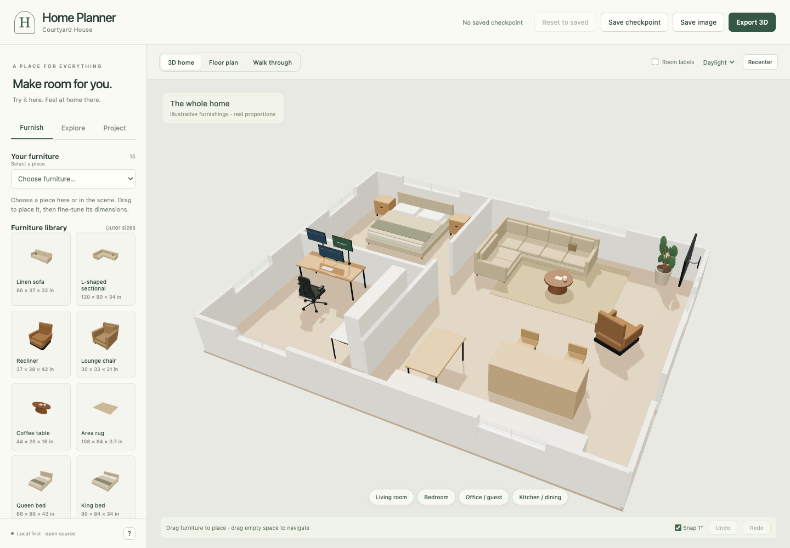

# Home Planner

[](https://github.com/harrison-quant-h2/home-planner/actions/workflows/ci.yml)
[](LICENSE)

**Try your furniture before you move it.** A local-first 3D planner for single-level homes, built with Three.js and plain JavaScript.



Arrange furniture at real scale, explore rooms at eye level, and return to a saved arrangement when an experiment doesn't work. No account, backend, analytics, or cloud upload service. The included home is fictional; all meshes and materials are procedural.

## Run locally

Requires **Node.js 24+**, **pnpm 11.19.0**, and a desktop browser with WebGL 2 support. Chromium is covered by automated tests. Other browsers and mobile devices are not yet in the automated support matrix.

```sh
# Install pnpm if you do not already have it.
npm install --global pnpm@11.19.0

git clone https://github.com/harrison-quant-h2/home-planner.git
cd home-planner
pnpm install --frozen-lockfile
pnpm dev
```

Open **http://127.0.0.1:5173**. No API keys or environment variables are needed. After dependencies are installed, the local app needs no internet connection. Opening documentation links does leave the app.

## What you can do

- **Furnish:** drag pieces, enter exact dimensions, rotate, duplicate, recolor, remove, undo, and redo. Use the furniture dropdown to select without pointing at the scene.
- **Compare fit:** check oriented footprints, sectional returns, walls, window heights, fixtures, and approximate door approaches. Preview recliner and queen desk-bed deployment.
- **Plan an office:** use a 72 × 30 inch desk, rolling chair, convertible bed/worktop, monitor arrangements, or a swiveling wall TV. An optional end headboard is explicitly an unverified concept.
- **Explore:** orbit a cutaway 3D model, switch to a floor plan, or walk through room viewpoints. Toggle labels and lighting mood.
- **Keep alternatives:** working drafts autosave locally. **Save checkpoint** records a separate arrangement and camera; **Reset to saved** restores both. Undo can reverse a reset.
- **Export:** download a complete project as JSON, a view as PNG, or a GLB model in meters, including the ceiling and furniture.

## Model your home

Open **Project → Download project JSON** to make a working copy. Edit the JSON in a text editor, then use **Open project** to load it. The project contains the floor polygon, walls, doors, windows, fixtures, room cameras, and furnishings.

See the [project format guide](docs/project-format.md), [fictional example](public/examples/courtyard.json), and [user guide](docs/user-guide.md). There is no visual wall-drawing editor or automatic floor-plan/photo conversion in this release.

Architecture coordinates are **feet**; furniture dimensions are **inches**. Exported GLB geometry is **meters**. Keep personal plans and exports outside the repository or in the git-ignored `private/` directory. Anything placed in `public/` ships with the app.

## What the model does not prove

This is a furnishing study, not surveyed CAD, a building-code checker, or a furniture mechanism simulator. Fit warnings use simplified geometry. They do not certify circulation, accessibility, delivery paths, load capacity, wall anchors, exact door sweeps, or clearance through a bed's opening motion. Screen glare and sunlight are not simulated. Kitchen fixtures are dimensioned blocks, not detailed appliance models. Multi-floor homes, CAD/BIM import, collaboration, and photorealistic path tracing are outside this release.

## Develop

```sh
pnpm check                      # lint, formatting, unit tests, production build
pnpm exec playwright install chromium
pnpm test:e2e                   # browser tests against the production build
pnpm format                     # format source and docs
```

On Linux, `pnpm exec playwright install --with-deps chromium` also installs browser system dependencies. Run `pnpm build` before browser tests when code has changed.

The browser suite verifies startup, navigation, checkpoint/reset/reload, undo/redo, Murphy-bed and monitor controls, rejected imports, safe text rendering, and JSON/PNG/GLB downloads. CI runs these checks on Linux with Node 24 and Chromium. See [architecture](docs/architecture.md) and [contributing](CONTRIBUTING.md).

## Build and host

```sh
pnpm build
pnpm preview                    # http://127.0.0.1:4173
```

Deploy the contents of `dist/` to any static host. Relative asset paths support subdirectories. No server API is required. Use HTTPS on a remote host; localhost works over HTTP. `pnpm dev` and `pnpm preview` bind to loopback and are development tools, not production servers. See [deployment and privacy](docs/deployment.md).

## Contribute

Bug reports, focused fixes, geometry improvements, and documentation are welcome. Start with [CONTRIBUTING.md](CONTRIBUTING.md), [the code of conduct](CODE_OF_CONDUCT.md), and [open issues](https://github.com/harrison-quant-h2/home-planner/issues). Please use fictional or redacted plans in public reports.

## License and attribution

Original application code, procedural assets, and the fictional demo are [MIT licensed](LICENSE). Three.js is MIT licensed; its notice is included in [THIRD_PARTY_NOTICES.txt](public/THIRD_PARTY_NOTICES.txt). Furniture names and dimensions are illustrative planning presets, not certified product models or manufacturer endorsements.
